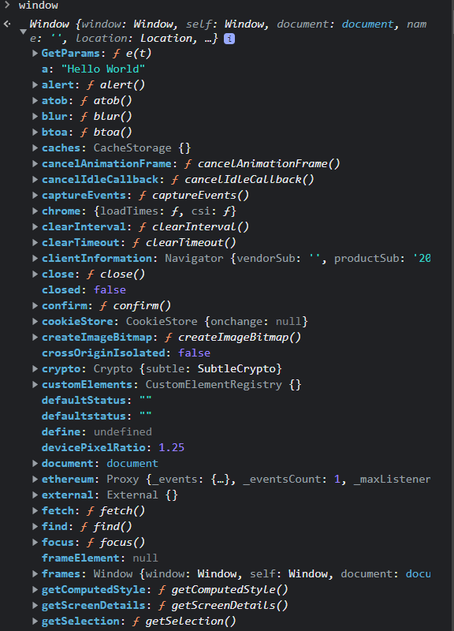

# What is hoisting?

Before learning what hoisting is we need to talk about how Javascript works under the hood.

When the browser sees a script file in an HTML file, it sends it to the Javascript Engine. Then the engine starts to create a code wrapper that is called "Execution Context".

## The Execution Context

The execution context contains codes currently running and other features beyond the codes. There are two types of execution context in Javascript.(Global Execution Context(GEC) and Function Execution Context(FEC)).

GEC is created initially by the engine no matter whether the Javascript file has code or not. The codes that are not inside a function lexically get executed there.

FEC is created by the engine when a function is called.(Function Invocation)

The execution context is created in two phases in this order: Creation Phase and Execution Phase.

These phases are created in the same way both GEC and FEC.

Let us talk about the "Creation Phase".

### The Creation Phase for GEC

For GEC, an object which is called a "Global Object" is created. It stores variables and function declarations that sit lexically on the global level thanks to the parser. Also it has other properties about environment where the Javascript file run. For web browsers, that global object is equivalent to the browser's window object and stores variables and function declarations. For nodeJS, it is equivalent to another thing. (I haven't known NODE yet.)

Secondly, after the global object, the scope chain is created by the engine. The scope chain allows us to use variables which are defined in its scope and outer scopes.

Finally, the "this" keyword is created by the engine and the "this" keyword refers to the global object.

### The Creation Phase for FEC

For FEC, an object is created. This object contains the variables and function declarations which are defined in the function's scope and an array-like object which is called "argument" object. That object contains function's arguments. The "this" keyword and the scope chain is created as well.

## So, What is hoisting?

As we talked about in the creation phase of the execution context, an object contains the variables and function declarations. The engine scans the codes all the way down. When it encounters a variable, it stores that variable without its value. Instead, it adds a placeholder which is a special keyword "undefined". During the execution phase, the engine scans the codes again and dedicates the real value to variable. That's why when we want to use the variable before define it, we see "undefined" in the console.

For function declarations, the situation is a little different. In the creation phase, the engine saves the function to the memory and during the execution phase we can access to that function before defining it.

The name of this operation is "hoisting". :)))

!!

WARNING: THIS IS NOT A FULL DETAILED HOISTING DOCUMENTATION. THIS IS NOT USED FOR EDUCATIONAL PURPOSES.
